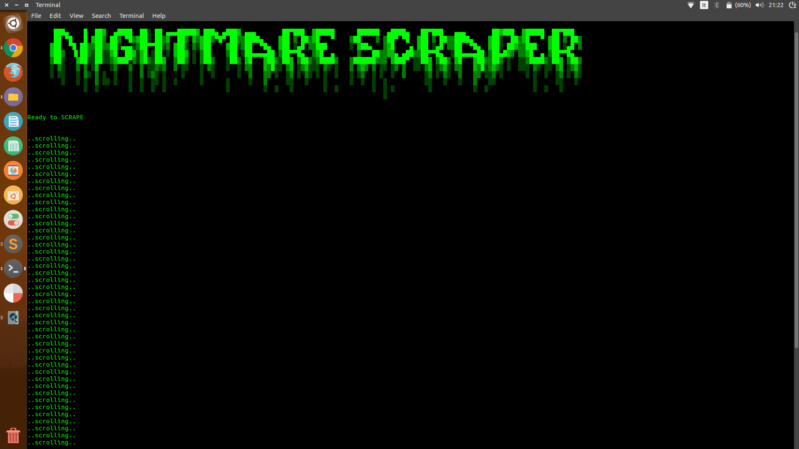

# Nightmare.js Scraper Example

 

 

### Description

This is an example on how use Nightmare.js to scrape websites.

 

- The scraper open an url and recursively clicks a button to load more information until it reaches the end of the document.

- Then It downloads all the companies logos using the npm package [image-downloader](https://www.npmjs.com/package/image-downloader) .
	
 

It also uses [figlet](https://www.npmjs.com/package/figlet), a npm package to implement the FIGfont.

 

 
 